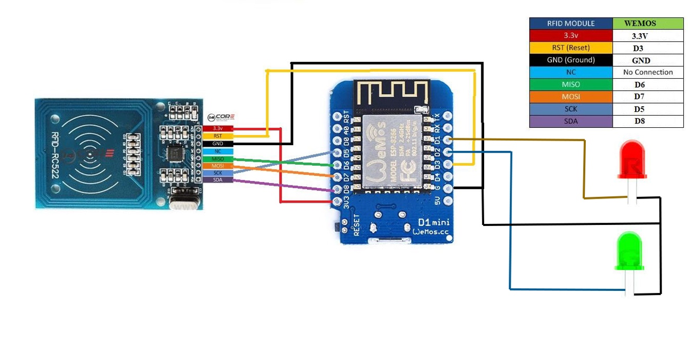

# ACCESDUINO 3.0

## INTRODUCCIÓN

Este proyecto, ACCESDUINO 3.0, está diseñado para gestionar el registro de entrada y salida de empleados utilizando tarjetas 
RFID y un formulario web, adecuado para cualquier empresa que necesite este tipo de soluciones.

## CARACTERÍSTICAS PRINCIPALES
El sistema tiene como función esencial permitir gestionar los siguientes procesos:
- **Gestión de Información:** Permite un fácil acceso y control de la información del personal.
- **Generación de Reportes:** Facilita la creación de reportes según la información requerida.
- **Configuración de Tarjetas RFID:** Permite la configuración y grabación de datos en tarjetas RFID.

La aplicación consta de varias interfaces principales, cuyo aspecto y funcionalidad dependerán del rol del usuario registrado.

El sistema de registro de entrada y salida de empleados tendrá dos funcionamientos diferenciados:
- **Tarjetas RFID:** Se registran las entradas y salidas de empleados interactuando con un lector de tarjetas RFID fabricado 
y programado por nosotros que identificara cada empleado a través de una tarjeta RFID.
- **Formulario web:** Se registrarán las entradas y salidas de empleados introduciendo un login y password en un formulario web.


## CÓDIGO FUENTE

El código fuente de ACCESDUINO 3.0 está disponible en un archivo comprimido que incluye:

- Frontend en Angular sin librerías. Para instalar librerías, ejecutar `npm i`.

## GUÍA DE INSTALACIÓN

### INSTALACIÓN BACKEND

El backend esta desarrollado con php utilizando el framework Laravel.

Para instalarlo colocaremos la carpeta “api” en el servidor web y una vez hecho tenemos que instalar Composer.

Necesitamos disponer de una base de datos, en nuestro caso vamos ha utilizar MySql.

Una vez que disponemos de los datos de conexión de la base de datos pasamos a modificar el archivo de configuración de 
Laravel que se encuentra en la raíz del proyecto y se llama “.env”.

```
DB_CONNECTION=mysql (Tipo de base de datos) 
DB_HOST={{Dirección de la base de datos}} 
DB_PORT={{Puerto de conexión}} (3306) 
DB_DATABASE= {{nombre de la base de datos}} 
DB_USERNAME={{Nombre de usuario}}
DB_PASSWORD={{Password}}
```

Ya que tenemos configurado Laravel pasamos a crear la tablas en la base de datos. Para ello ejecutamos

`php artisan migrate`

Instalamos el modulo Passport de Laravel que nos habilita todo el modulo de autenticación y seguridad de Laravel. 
Esto no devolverá los datos que necesitaremos para configurar los métodos de autenticación que nos devolverá los token. 
Necesitaremos el que se define como “Password grant client created successfully”, tanto el “Client Id” como el “Client secret”.

`php artisan passport:install`

Configurar todos los datos necesarios para el funcionamiento de la aplicación:

- Usuario de administrador 
- Rol de administrador 
- Permisos disponibles.

`php artisan app:install`

Para esto nos solicitara, el nombre que queremos ponerle al usuario administrador, el email del administrador y el password del administrador.

Crear datos de prueba para la aplicación, ejecutar:

`php artisan db:seed

### INSTALACIÓN FRONTEND
Desarrollado con Angular.

Instalar librerías 

`npm i`.

Configurar los parámetros de conexión en ```src/environments/environment.prod.ts```
```
url: <Direccion de la raíz de api>, 
client: <Client Id>, 
secretClient: <Client secret>, 
grantType: 'password'
```

Compilar el proyecto con 

```ng build --prod --base-href="./"```.

### INSTALACIÓN LECTOR RFID
**Material necesario:**
- Wemos D1 Mini ESP8266 ESP-12E CH340
- Módulo RFID RC522 + Tarjeta 13,56 Mhz Llavero Tag NFC RFID
- 2 LEDs de colores diferentes (Rojo y Verde)
- Cables para conexiones

**Esquema de montaje**


**Programación:**
Utilizar Arduino IDE para cargar el script proporcionado, que maneja la lectura de tarjetas y la comunicación con el backend para registrar eventos.


